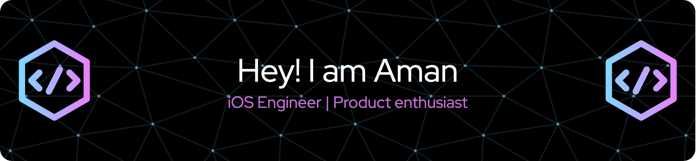

# Hi there 👋, My name is Aman

A very enthusiastic iOS developer with a very diverse experience, from building games to enterprise applications and POCs, specially when exploring new technologies.

iOS/watchOS/tvOS/macOS Developer, UI/UX Designer, Swift Lover, Xcode & Sketch Lover, Apple Geek and Git Lover, Designer + Coder, Creative Thinker, WWDC 2016 Student Scholarship Winner.

I ❤ to Design and Code | Product Enthusiasts 🚀

## 💫 Liitle Bit More About Me

🔭 I'm currently working on Sign Easy

🌱 I'm currently learning SwiftUI

📫 How to reach me? amannayak15@gmail.com

🤖 All of my projects are available at <a href="https://apps.apple.com/us/developer/digital-hole-pvt-ltd/id917701060">App Store</a>

Know about my experiences <a href="https://www.linkedin.com/in/aman-jain-4a589b8a/">here</a>

## 💻 Skills

## 👥 Connect With Me

